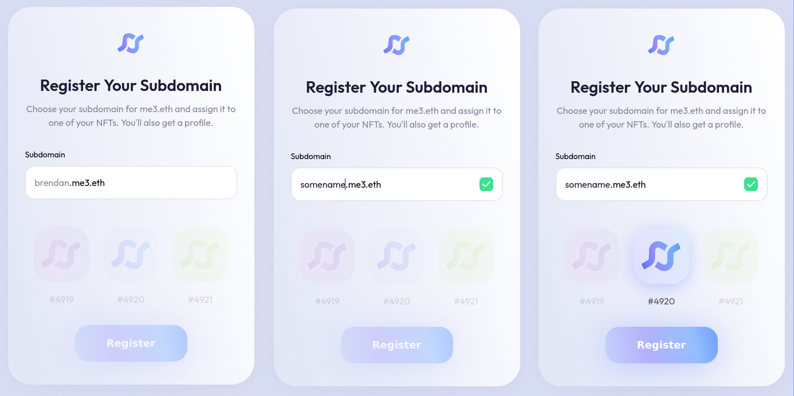

# Subdomain Claim Widget

Embeddable widget for claiming subdomains through the me3 subdomain registrar contracts.



## Installation

Use your favourite package manager:

```sh
npm i @me3/claim-widget

# OR
pnpm i @me3/claim-widget

# OR
yarn add @me3/claim-widget
```

## Project setup

Before the claim widget can be used, your project needs to be registered with me3.

1. Deploy `IAuthoriser` and `IRulesEngine` contract(s):
  * We have a simple one for NFT projects available to deploy at https://github.com/me3-eth/subdomain-registrar/README.md#nftauthoriser
2. Register project with me3: https://etherscan.io/address/0x809f89b26347156ff3f8f2842780ddafb1c4acde#writeContract
3. Set the me3 Subdomain Registrar as the controller for the project's ENS name

## Usage

The widget can be used in React, Vue, Svelte, HTML, or Angular as a Web Component.
Check out the examples to see usage:

* [React](/examples/react/README.md)
* [Vue](/examples/vue/README.md)

### Requirements

* Credentials for Alchemy API to pull NFTs
* A provider object that supports the following EIPs:
  * 1193
  * 1102
  * 3085
  * 3326

## Styles

The claim-widget is themable. These are the default values:

```css
:root {
  --me3-text-color: #1C1C33;

  --me3-container-border-radius: 40px;
  --me3-container-padding: 40px 30px;
  --me3-container-background: linear-gradient(257.35deg, #FFFFFF 0%, rgba(255, 255, 255, 0.25) 100%);
  --me3-container-box-shadow: 0px 6px 30px rgba(108, 108, 128, 0.06);
  --me3-container-item-gap: 32px;

  --me3-claimbtn-height: 64px;
  --me3-claimbtn-width: 196px;
  --me3-claimbtn-background: linear-gradient(256.24deg, #3D73FF -30.68%, rgba(121, 174, 255, 0.8) 23.64%, rgba(145, 142, 255, 0.75) 63.28%, rgba(87, 122, 255, 0.35) 97.37%);
  --me3-claimbtn-box-shadow: 0px 6px 60px rgba(134, 158, 255, 0.5);
  --me3-claimbtn-text-color: #ffffff;
  --me3-claimbtn-border-radius: 24px;
  --me3-claimbtn-border: none;

  --me3-input-border-radius: 16px;
  --me3-input-border: 1px solid #dedede;
  --me3-input-padding: 16px;
  --me3-input-margin: 0px;
  --me3-input-background: #ffffff;
  
  --me3-label-margin: 0 0 8px 0;
  --me3-label-font-size: 14px;
  --me3-label-line-height: 24px;
  --me3-label-font-weight: 500;
  --me3-label-display: block;
}
```

## Development

1. Clone
2. install pkgs
3. ???

### Add new example

1. Try to keep it light
2. Install as a runnable application in subfolder of _examples/_
